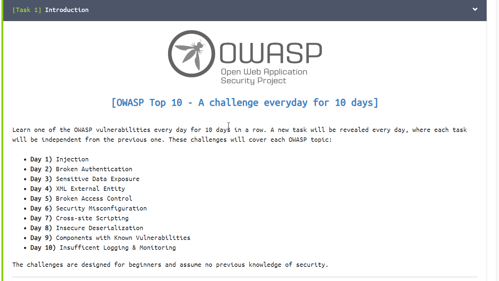
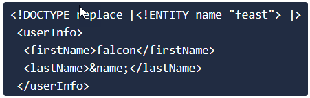
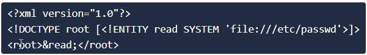

# TryHackMe-OWASP-Top10

**[Click Here and Try It Out!](https://tryhackme.com/room/owasptop10)**

## [OWASP Top 10 - A challenge everyday for 10 days]

Learn one of the OWASP vulnerabilities every day for 10 days in a row. A new task will be revealed every day, where each task will be independent from the previous one. These challenges will cover each OWASP topic:

> My First Try at Hacking Lab Write-Ups ;)

### Day 1:

**Vulnerability:** <code> Injection </code>

**Target:** <code>http://MACHINE_IP/evilshell.php.</code> 
***Simple Description: A Search bar is given, we also know that the PHP Code for the same allows command injection***

**Questions:**

.png)

#### Approach for each Question: (Answers are at the end)
**Question 1:** <code> What strange textfile is in the website root directory ? </code> 
**My Solution:**

A simple <code>ls</code> command gave away the name of a textfile. 
Ideally, I should have also checked the root directory using <code>pwd</code>.

**Question 2:** <code> How many non-root/non-service/non-daemon users are there ? </code> 
**My Solution:**

This seemed difficult at first, on running <code>cat /etc/passwd</code>, even though all the users were displayed, still I wasn't able to figure out much.
  I searched up online and then used <code> cut -d: -f1 /etc/passwd </code> to get only the usernames. Comparing this output with a similar output on my own
terminal led me to realise that there are no such non-special users.

**Question 3:** <code> What user is this app running as ? </code> 
**My Solution:**

This was easy, a simple <code>whoami</code> did the task.

**Question 4:** <code>What is the user's shell set as ? </code> 
**My Solution:**

This was the trickiest in my opinion. I used this amazing guide on the forums to figure it out. <a href ="https://medium.com/@tirthesh.pawar/owasp-top-10-day-1-injection-e1d5b15b1baf">Link to the Article</a>. On deeper analysis of the <code>cat /etc/passwd</code> result. We find the answer. I owe this answer fully to this article. I realised that I needed to know what <code>cat /etc/passwd</code> actually gave.

**Question 5:** <code> What version of Ubuntu is running ? </code> 
**My Solution:**

This again was pretty easy. <code>lsb_release -a</code> did the job.

**Question 6:** <code> Print out the MOTD. What favorite beverage is shown ? </code> 
**My Solution:**

I tried a pretty amateur apporach at this. On opening the contents of the file that we found in *Question 1*, I thought I'd try out the same as the answer and it worked!
  Yet actually, (again had to use this <a href ="https://medium.com/@tirthesh.pawar/owasp-top-10-day-1-injection-e1d5b15b1baf">article</a>) the "message-of-the-day" file had been changed to "00-header" as mentioned in the *Hint*.Thus, using <code>cat /etc/update-motd.d/00-header</code>, the answer was finally revealed.

#### Answers: (CAUTION!: If you are also trying this machine, I'd suggest you to maximise your own effort, and then only come and seek the answers. Thanks.)
**Q1:** <code>drpepper.txt</code>
**Q2:** <code>0</code>
**Q3:** <code>www-data</code>
**Q4:** <code>/usr/sbin/nologin</code>
**Q5:** <code>18.04.4</code>
**Q6:** <code>Dr Pepper</code>

---------------------------------------------------------------------------------------------------------------------------------------------------------------------------------

### Day 2:

**Vulnerability:** <code> Broken Authentication </code>

**Target:** <code>http://MACHINE_IP:8888</code> 
***Simple Description: A SignIn Button and a Register Button is given on the top, 2 fields are given for Sign-Up and a new set of 3 fields is opened up on Registration***

**Questions:**

.png)

#### Approach for each Question: (Answers are at the end)
**Question 1:** <code> 	What is the flag that you found in darren's account ? </code> 
**My Solution:**

We are given that there is an account named <code>darren</code> which contains a <i>flag</i>. To access this account, if we try something like <code>darren </code> (Notice the space at the end), or even <code>   darren</code> (3 spaces in the front), for <b>REGISTERING</b> a new account and then we try Logging in with this account. Then we are able to access the account details, in this case, the <i>flag</i> from the actual <i>darren</i> account.

**Question 2:** <code> Now try to do the same trick and see if you can login as arthur. </code> 
**Not Solution Based, only apply the above method again.**

**Question 3:** <code> What is the flag that you found in arthur's account ? </code> 
**My Solution:**

By trying the same method as in Darren's account, we are able to reach the flag in this one too!  What's important though, is going to the next level. Thus, I tried out various different types of alternative inputs like <code>arthur.</code> <code>art hur</code> <code>_arthur</code> <code>"arthur"</code>.  Well, none of those actually work and thus I realised that only <i>blank spaces</i> can be used to check Broken Authentication successfully.

#### Answers: (CAUTION!: If you are also trying this machine, I'd suggest you to maximise your own effort, and then only come and seek the answers. Thanks.)
**Q1:** <code>fe86079416a21a3c99937fea8874b667</code>
**Q2:** <code>No Answer Required</code>
**Q3:** <code>d9ac0f7db4fda460ac3edeb75d75e16e</code>

---------------------------------------------------------------------------------------------------------------------------------------------------------------------------------

### Day 3:

**Vulnerability:** <code> Sensitive Data Exposure </code>

**Target:** <code>http://MACHINE_IP</code> 
***Simple Description: A wesbites is given. We need to access the SQLite database and find crucial leaked information***

**Questions:**

.png)

#### Approach for each Question: (Answers are at the end)
**Question 1:** <code> 	What is the name of the mentioned directory ? </code> 
**My Solution:**

I used the hint for this. But after that it became pretty clear. An important point to be noted is that <i>View Page Source</i> and more over looking it at very closely is a really necessary skill that all budding Ethical Hackers and Security Researchers need to understand!

**Question 2:** <code> Navigate to the directory you found in question one. What file stands out as being likely to contain sensitive data ? </code> 
**My Solution:**

This was pretty simple. When sensitive data is directly under the root directory, then you can directly see the "database file" that we need to access.

**Question 3:** <code> Use the supporting material to access the sensitive data. What is the password hash of the admin user ? </code> 
**My Solution:**

This requires understanding the support material about SQLite Databases. The basics are as follows:  
<ol>
  <li>Run <code>file <filename></code> in the <b>terminal</b>. This gives you the "File Type" and "Version" of the same file-type.</li>
  <li>Since it is an SQLite DB, we use <code>sqlite3 <filename></code> to access the tables under it.</li>
  <li>A really important command to be used is <code>.help</code>. Infact, we should use this anywhere and everywhere, if we're unfamiliar to the specific command.</li>
</ol>
After this, we just need to run some of the commands mentioned in the Support Material related to SQL Queries.

**Question 4:** <code> Crack the hash. What is the admin's plaintext password ? </code> 
**My Solution:**

<a href="https://crackstation.net/">Crack-Station</a> is the "go-to" place for Cracking Hashes. What's more interesting is that you can download the 15GB wordlist for your own use as well!

**Question 5:** <code> Login as the admin. What is the flag ? </code> 
**My Solution:**

Once we have the admin access from the SQLite Database, we just need to login as admin and the flag appears right there.

#### Answers: (CAUTION!: If you are also trying this machine, I'd suggest you to maximise your own effort, and then only come and seek the answers. Thanks.)
**Q1:** <code>/assets</code>
**Q2:** <code>webapp.db</code>
**Q3:** <code>6eea9b7ef19179a06954edd0f6c05ceb</code>
**Q4:** <code>qwertyuiop</code>
**Q5:** <code>THM{Yzc2YjdkMjE5N2VjMzNhOTE3NjdiMjdl}</code>
 
**Bonus:** 
This was really fun to try out. Here goes the description for the same: 
<i>To spice things up a bit, in addition to the usual daily prize draw this box also harbours a special prize: a voucher for a one month subscription to TryHackMe. There may or may not be another hint hidden on the box, should you need it, but for the time being here's a starting point: boxes are boring, escape 'em at every opportunity.</i>
 

I tried various things here, <code>ssh</code>, <code>nmap</code>, <code>metasploit</code>, but unfortunately, I failed to get through or even find the answer. I wasn't disheartened though. This bonus question has been an amazing learning experience 😊

---------------------------------------------------------------------------------------------------------------------------------------------------------------------------------

### Day 4:

**Vulnerability:** <code> XML External Entity </code>

**Target:** <code>http://MACHINE_IP</code> 
***Simple Description: An XXE Payload TextField is given, Certain tasks are to be done***

**Questions:**

*P1: eXtensible Markup Language Basics*

Here we had to learn the basics of XML, its syntax and its use.

.png)

#### Questions: 
**Question 1:** <code> Full form of XML </code> 
**Question 2:** <code> Is it compulsory to have XML prolog in XML documents ? </code> 
**Question 3:** <code> Can we validate XML documents against a schema ? </code> 
**Question 4:** <code> Full form of XML </code> 

#### Since, these questions are quite basic, the answer is in the attached image only

*P2: XML DTD Basic*

Now we go into the basics of DTD.   DTD stands for Document Type Definition. A DTD defines the structure and the legal elements and attributes of an XML document.

.png)

#### Questions: 
**Question 1:** <code> How do you define a new ELEMENT ? </code> 
**Question 2:** <code> How do you define a ROOT element? </code> 
**Question 3:** <code> How do you define a new ENTITY? </code> 

#### Since, these questions are also quite basic, the answer is in the attached image only

*P3: XXE Payload basics*

We get a really detailed description of how do we really use XXE payloads. It is possible to print out data on the webpage easily by using 

  
What is more important to understand it the fact, that by using some system commands, we can also print <code>/etc/passwd</code> contents on it!

*P4: XXE Exploitation Basics*

Finally!!! 
Now we have to actually use these exploist learnt to do the following:

_(Blurred).png)

#### Questions: 
**Question 1:** <code> Try to display your own name using any payload. </code> 
**My Solution:**

As far as this goes, based on the first exploit in <i>P3</i>, I could have just replaced "feast" with my name. But I realised, that if you just put 2 opening and closing tags, like <code>&lt;name&gt;Nishant&lt;name/&gt;</code>, then also, the exploit works well

**Question 2:** <code> See if you can read the /etc/passwd </code> 
**My Solution:**

This is the second exploit mentioned in <i>P4</i>.

**Question 3:** <code> What is the name of the user in /etc/passwd ? </code> 
**My Solution:**

Well, navigating to the end of the result that we recieved in the previous question, we find that the user name is clearly visible (It stands apart from the root/service/daemon users)

**Question 4:** <code> Where is falcon's SSH key located ? </code> 
**My Solution:**

I needed to search this up online as to where the SSH Keys are actually located. 
Honestly speaking though, I didn't have much confidence to try it out that time, even though I had found the answer. I'm thankful to this great <a href="https://medium.com/@musyokaian/owasp-top-10-tryhackme-b7d02f29254b">write-up</a>, that helped me out. I'd like to take this moment to say that never lose faith in your hardwork or yourself.  <b>You have great potential! Always remember that and Never Give Up!</b>

**Question 5:** <code> What are the first 18 characters for falcon's private key ? </code> 
**My Solution:**

Once, we displayed the data from the SSH Key file (using the method like the second exploit), we were able to easily view the SSH Key!

#### Answers: (CAUTION!: If you are also trying this machine, I'd suggest you to maximise your own effort, and then only come and seek the answers. Thanks.)
**Q1:** <code>No Answer Required.</code>
**Q2:** <code>No Answer Required.</code>
**Q3:** <code>falcon</code>
**Q4:** <code>/home/falcon/.ssh/id_rsa</code>
**Q5:** <code>MIIEogIBAAKCAQEA7</code>

---------------------------------------------------------------------------------------------------------------------------------------------------------------------------------

### Day 5:

**Vulnerability:** <code> Broken Access Control </code>

**Target:** <code>http://MACHINE_IP</code> 
***Simple Description: A target machine is given, IDOR and Broken Access Control are to be learned and exploited!***

**Questions:**

.png)

#### Approach for each Question: (Answers are at the end)
**Question 1:** <code> Read and understand how IDOR works. </code> 
**My Understanding of IDOR:**

IDOR or Insecure Direct Object Reference, is an important vulnerability which comes under Broken Access Control. Being able to access data which is not meant to be accessed by normal users, is an exaple of Broken Access Control. In simple words, say that you are able to login to your bank account and the following is your link in the address bar, <code>https://example.com/bank?account_number=1234</code>. You might not notice this normally, but if you consider an attacker, then all they need to do is change the account number in the above URL and lo and behold!, all your data belongs to the attacker!

**Question 2:** <code> Deploy the machine and go to http://MACHINE_IP - Login with the username being noot and the password test1234. </code> 
**No Answer Required**

**Question 3:** <code> Look at other users notes. What is the flag ? </code> 
**My Solution:**

This is IDOR in action, the fact that we are able to change the <code>note</code> number paramter in the URL (<code>http://MACHINE_IP/index.php?note=1</code>), and then navigate to a specific note, shows how we are able to read and access someone else's data!

#### Answers: (CAUTION!: If you are also trying this machine, I'd suggest you to maximise your own effort, and then only come and seek the answers. Thanks.)
**Q1:** <code>No answer needed</code>
**Q2:** <code>No answer needed</code>
**Q3:** <code>flag{fivefourthree}</code>

---------------------------------------------------------------------------------------------------------------------------------------------------------------------------------

### Day 6:

**Vulnerability:** <code> Security Misconfiguration </code>

**Target:** <code>http://MACHINE_IP</code> 
***Simple Description: A target machine is given and the question is pretty simple. Hack the webapp and find the flag***😅

**Questions:**

.png)

#### Approach for each Question: (Answers are at the end)
**Question 1:** <code> Deploy the VM. </code> 
**No Answer Required**

<b>An important point!</b> Pensive Notes is the target web-app and we wish to hack into it. As far as Security Misconfigurations go, not changing the <b>default</b> passwords is what leads to major problems!

**Question 2:** <code> Hack into the webapp, and find the flag ! </code> 
**My Solution:**

Turns out, that problems like these require a bit more effort. More than effort, they require experience! As a beginner, when I'm told to <i>look into the "source code"</i>, I would naturally go to <code>Inspect Element</code> or <code>View Page Source</code>. With some help from the TryHackMe Discord Server, I realised and well, now have understood, that for source code and documentation, my go-to place is <a href="https://github.com/explore">GitHub</a>.  Moreover, sometimes using <b>GitHub Search</b> instead of <b>Google Search</b> can help you reach the solution.

#### Answers: (CAUTION!: If you are also trying this machine, I'd suggest you to maximise your own effort, and then only come and seek the answers. Thanks.)
**Q1:** <code>No answer needed</code>
**Q2:** <code>thm{4b9513968fd564a87b28aa1f9d672e17}</code>

---------------------------------------------------------------------------------------------------------------------------------------------------------------------------------

### Day 7:

**Vulnerability:** <code> Cross-Site Scripting </code>

**Target:** <code>http://MACHINE_IP</code> 
***Simple Description: Try out XSS on*** <code>http://MACHINE_IP/reflected</code> ***and*** <code>http://MACHINE_IP/stored</code> ***, to answer the following questions!***

**Questions:**

.png)

#### Approach for each Question: (Answers are at the end)
**Question 1:** <code> Deploy the VM. </code> 
**No Answer Required**

**Question 2:** <code> Go to http://MACHINE_IP/reflected and craft a reflected XSS payload that will cause a popup saying "Hello". </code> 
**My Solution:**

Now see, this is something important to note. Ethical Hacking is NOT the use of random tools or scripts to gain access. Then you just exist as a script kiddie. To really get good at it (I'm a beginner😅, by the way), you must learn certain core concepts and perhaps even go deep into them! Take XSS for that matter. It is obvious to think that you might get around by copying some payload scripts. But no. Without some knowledge of JavaScript <i><b>(and more advanced knowledge, if you wish to get good at this)</b></i>, you won't be able to craft new exploits or mould them according to your situation. In short, <i>Learn Everything!</i>🙂.  So as far as this exploit goes, it was a simple <code>&lt;script&gt;onclick(alert("Hello"));&lt;/script&gt;</code> script which did the magic. After clicking on the search button, first we see <b>"Hello"<b> and then the answer.

**Question 3:** <code> On the same reflective page, craft a reflected XSS payload that will cause a popup with your machines IP address. </code> 
**My Solution:**

This is an example of moulding or re-crafting your own exploit. Take <code>&lt;script&gt;onclick(alert("Hello"));&lt;/script&gt;</code> and instead of <b>"Hello"</b>, use <code>window.location.hostname</code>. To validate my point about learning JavaScript, here is a picture of the hint from TryHackMe.

 

 
**Question 4:** <code> Now navigate to http://MACHINE_IP/stored and make an account. Then add a comment and see if you can insert some of your own HTML. </code> 
**My Solution:**

Okay, so what this page basically has a comment box, where the input data is dangerously unsanitised. Adding a simple <code>&lt;h1&gt;Hi&lt;/h1&gt;</code>, would help you see the answer right on the page!

**Question 5:** <code> On the same page, create an alert popup box appear on the page with your document cookies. </code> 
**My Solution:**

This is similar to Question 3. instead of <code>window.location.hostname</code>, just use <code>document.cookie</code>.

**Question 6:** <code> Change "XSS Playground" to "I am a hacker" by adding a comment and using Javascript. </code> 
**My Solution:**

Finally, the part that seems most exciting! You can change the way the wesbite looks! And that too for all Users! I did have to use a hint for this though. Turns out, that here we use something like <code>&lt;script&gt;document.querySelector('#thm-title').textContent = 'I am a hacker'&lt;/script&gt;</code> to change the title. What's more important is, that we can similarly affect other elements in the page if we known their <code>span id</code>.

#### Answers: (CAUTION!: If you are also trying this machine, I'd suggest you to maximise your own effort, and then only come and seek the answers. Thanks.)
**Q1:** <code>No answer needed</code>
**Q2:** <code>ThereIsMoreToXSSThanYouThink</code>
**Q3:** <code>ReflectiveXss4TheWin</code>
**Q4:** <code>HTML_T4gs</code>
**Q5:** <code>W3LL_D0N3_LVL2</code>
**Q6:** <code>websites_can_be_easily_defaced_with_xss</code>

---------------------------------------------------------------------------------------------------------------------------------------------------------------------------------
